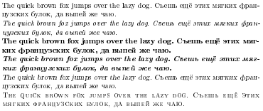
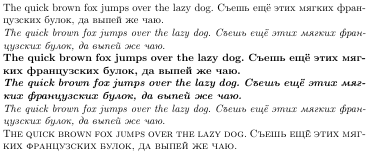

# Сравнение LaTeX и XeLaTeX

Лучше компилировать при помощи XeLaTeX, вместо pdflatex, так как он поддерживает шрифты, и итоговый PDF файл у него получается лучше. Но для того, чтобы использовать стандартный шрифт Computer Modern для русского языка в XeLaTeX, необходимо написать некоторый код, который описан в файле `xelatex.tex`.

| |LaTeX|XeLaTeX|
|-|-|-|
|Компиляция|`pdflatex`|`xelatex`|
|Размер|128 КБ|41 КБ|
|Изображение|||